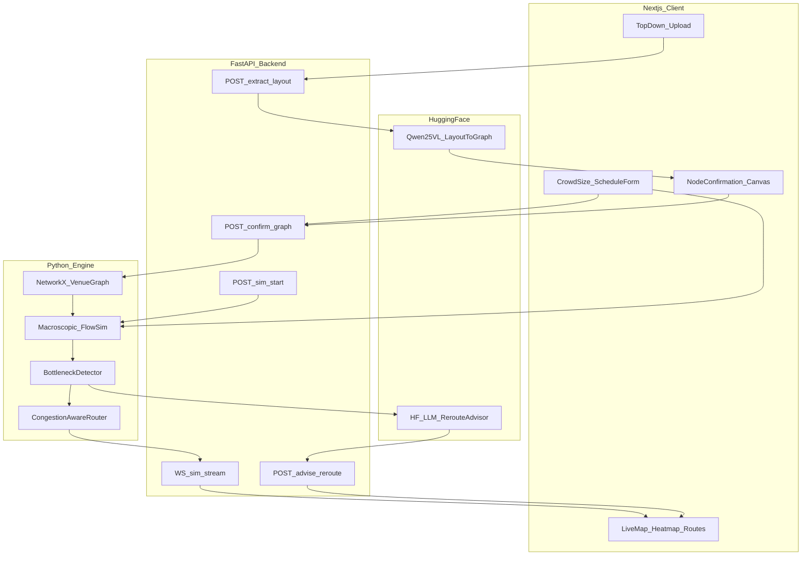

# Crowd Flow Optimiser — End-to-End Architecture

**Hackathon:** AI Race Month · Problem Statement 3  
**Sponsor constraint:** Hugging Face mandatory in the intelligent core  
**Core approach (locked):** Approach 1 — Hybrid Graph-Macro + HF VLM + HF Advisor  
**Build window:** ~3 days  
**Status:** Architecture locked — ready to implement on approval to execute

---

## 1. Product in one paragraph

Upload a **top-down venue layout**, enter **expected crowd size** and an **event schedule**, visually **confirm/edit extracted nodes**, then run a live simulation that shows **bottleneck zones** and **recommended rerouting paths** on a map. Hugging Face models extract the layout graph and advise reroutes; a Python macroscopic simulator owns crowd physics.

---

## 2. Locked decisions

| Decision | Choice |
|---|---|
| Intelligent core | Approach 1 (not JuPedSim-first, not GNN-first) |
| Layout input | Top-down image (primary) |
| Crowd + schedule | Manual entry (required for sim) |
| Graph trust | Visual confirmation UI before simulation can start |
| Frontend | Next.js (TypeScript) |
| Backend / sim / HF calls | Python FastAPI |
| Real-time live map | WebSockets (batched ticks ~10–15 Hz) |
| Graph model | NetworkX venue graph |
| Pathfinding | Congestion-weighted Dijkstra / A* (squared density penalty) |
| HF models | Qwen2.5-VL (layout → JSON graph) + HF chat LLM (reroute advisor) |
| Optional HF overlay | CSRNet / PET on sim-rendered “virtual CCTV” frames (Day 3 stretch) |
| Deploy target | Local demo + HF Space for backend/demo; Next.js on Vercel or all-in-one Space/Docker |

---

## 3. System architecture



### Responsibility split

| Layer | Owns | Does not own |
|---|---|---|
| Next.js | Upload, forms, node drag/confirm, live map UI | Crowd physics, HF model weights |
| FastAPI | Orchestration, schemas, WS fan-out, HF client | Pixel rendering of map (client) |
| HF VLM | Nodes/edges/POI extraction from top-down image | Simulation timesteps |
| Python sim | Density, queues, bottlenecks, base paths | Natural-language advice |
| HF LLM | Ranked reroute actions + operator copy | Inventing geometry |

---

## 4. Tech stack

### Frontend (`apps/web`)

- **Next.js 15** (App Router) + **TypeScript**
- **Tailwind CSS** + minimal UI (shadcn optional)
- **React Flow** or **Konva/canvas** for layout overlay + node confirmation
- **Map/live view:** canvas or SVG overlay on the uploaded top-down image (keep coordinates in image space)
- **Zustand** for client sim state
- **native WebSocket** client for tick stream

### Backend (`apps/api`)

- **Python 3.11+**
- **FastAPI** + **Uvicorn**
- **Pydantic v2** schemas
- **NetworkX** venue graph
- **NumPy** density / flux fields
- **httpx** / `huggingface_hub` / OpenAI-compatible HF Inference client
- **python-multipart** for image upload

### Hugging Face

| Role | Model | Usage |
|---|---|---|
| Layout extraction | `Qwen/Qwen2.5-VL-7B-Instruct` (or 3B if GPU/cost tight) | Image → structured venue JSON |
| Reroute advisor | `meta-llama/Llama-3.1-8B-Instruct` or `Qwen/Qwen2.5-7B-Instruct` via HF Inference | Bottleneck telemetry → structured actions + explanation |
| Demo hosting | Hugging Face Space (Docker or Gradio sidecar) and/or Hub model cards | Sponsor visibility |
| Stretch | `rootstrap-org/crowd-counting` or PET crowd model | Density check on rendered frames |

### Infra (3-day pragmatic)

- Monorepo: `apps/web`, `apps/api`, `packages/shared-types` (optional JSON schemas mirrored)
- Env: `HF_TOKEN`, `HF_VLM_MODEL`, `HF_LLM_MODEL`, `API_URL`
- Local: Docker Compose (`web` + `api`) for judge laptop reliability
- No Redis/DB required for MVP (in-memory session store)

---

## 5. User flow (exact product path)

1. **Upload** top-down venue image.
2. **Enter** expected crowd size + event schedule blocks (e.g. Main event 18:00–20:00, Break 20:00–20:30, Egress 20:30–21:00).
3. Backend calls **HF VLM** → candidate nodes/edges.
4. **Visual confirmation:** user sees markers on the image; can move, rename, delete, add gates/walkways/concessions/exits; set capacities where needed.
5. User hits **Confirm graph** — simulation is blocked until this step succeeds.
6. **Run simulation** — live map streams density heatmap, bottleneck badges, and recommended paths.
7. **Reroute panel** — HF LLM returns ranked interventions; applying one updates edge costs / gate metering and the live paths refresh.

---

## 6. Data contracts (shared schemas)

### 6.1 Event schedule

```json
{
  "timezone": "Asia/Kolkata",
  "blocks": [
    {
      "id": "main_event",
      "label": "Main event",
      "type": "attraction",
      "start": "18:00",
      "end": "20:00",
      "attractors": ["stage", "seating"],
      "arrival_rate_per_min": 40
    },
    {
      "id": "break",
      "label": "Intermission",
      "type": "break",
      "start": "20:00",
      "end": "20:30",
      "attractors": ["food_court", "restrooms"],
      "arrival_rate_per_min": 10
    },
    {
      "id": "egress",
      "label": "Exit rush",
      "type": "egress",
      "start": "20:30",
      "end": "21:00",
      "attractors": ["exit_a", "exit_b"],
      "arrival_rate_per_min": 0
    }
  ]
}
```

### 6.2 Venue graph (post-VLM, pre/post confirm)

```json
{
  "image_size": { "width": 1600, "height": 900 },
  "nodes": [
    {
      "id": "gate_n",
      "type": "entry_gate",
      "label": "North Gate",
      "x": 0.12,
      "y": 0.08,
      "capacity": 80,
      "confirmed": true
    },
    {
      "id": "food_1",
      "type": "concession",
      "label": "Food Stall A",
      "x": 0.55,
      "y": 0.42,
      "capacity": 40,
      "service_rate_per_min": 12,
      "confirmed": true
    },
    {
      "id": "exit_e",
      "type": "emergency_exit",
      "label": "East Exit",
      "x": 0.92,
      "y": 0.50,
      "capacity": 100,
      "confirmed": true
    }
  ],
  "edges": [
    {
      "id": "e1",
      "source": "gate_n",
      "target": "food_1",
      "type": "walkway",
      "length_m": 45,
      "width_m": 3.5,
      "capacity": 120
    }
  ]
}
```

**Node types (minimum):** `entry_gate`, `walkway_junction`, `concession`, `seating` / `attraction`, `restroom`, `emergency_exit`, `exit`

Coordinates are **normalized 0–1** relative to the uploaded image so the confirm UI and live map stay aligned.

### 6.3 Simulation tick (WebSocket)

```json
{
  "t": 312.0,
  "sim_time": "20:12",
  "nodes": {
    "gate_n": { "density": 0.82, "count": 66, "risk": 0.71 },
    "food_1": { "density": 0.94, "count": 38, "risk": 0.88 }
  },
  "edges": {
    "e1": { "flow": 22, "speed_factor": 0.41, "congested": true }
  },
  "bottlenecks": [
    {
      "id": "bn_food_1",
      "node_id": "food_1",
      "severity": "critical",
      "eta_critical_s": 0,
      "reason": "queue_exceeds_capacity"
    }
  ],
  "routes": [
    {
      "id": "r1",
      "purpose": "avoid_food_1",
      "path_node_ids": ["gate_n", "junction_2", "food_2"],
      "cost": 12.4
    }
  ]
}
```

### 6.4 HF LLM advisor output

```json
{
  "actions": [
    {
      "type": "reroute",
      "from_node": "gate_n",
      "avoid": ["food_1"],
      "prefer": ["food_2"],
      "priority": 1
    },
    {
      "type": "throttle_gate",
      "node_id": "gate_n",
      "meter_per_min": 30,
      "priority": 2
    }
  ],
  "summary": "Food Stall A is past critical density. Divert North Gate arrivals to Stall B and meter entry."
}
```

---

## 7. Intelligent core (detailed)

### 7.1 Layout extraction (HF VLM)

**Input:** top-down image + system prompt with strict JSON schema.  
**Output:** candidate `nodes` + `edges`.  
**Post-process (deterministic):**

- Clamp coordinates to `[0,1]`
- Deduplicate overlapping nodes
- Ensure every entry connects to at least one walkable path toward an exit
- Mark all nodes `confirmed: false` until UI confirm

**Fallback if HF is down:** manual place-nodes mode on the canvas (still demoable).

### 7.2 Visual confirmation (hard gate)

Simulation **cannot start** until:

- ≥1 `entry_gate`
- ≥1 `exit` or `emergency_exit`
- Connected graph from each entry to some exit
- User pressed **Confirm**

UI affordances: drag nodes, edit labels/types/capacities, add/delete nodes, draw/remove edges.

### 7.3 Macroscopic simulation

Discrete-time engine on the confirmed graph:

1. **Schedule driver** — for current `sim_time`, active blocks set arrival rates and attractor weights.
2. **Spawn** — inject agents (or continuous mass) at entry gates proportional to remaining crowd and schedule.
3. **Move** — flow along edges with capacity-limited throughput; speed drops as density rises (`speed = free_speed * (1 - density)^k`).
4. **Queues** — concessions/restrooms use service rates; excess becomes queue length → density.
5. **Egress** — egress blocks reweight targets toward exits.
6. **Emit tick** — node densities, edge flows, bottlenecks, current recommended paths.

This is **not** Social Force MVP. It is StadiumMind/CrowdControl-style macroscopic flow — fast enough for a live map in 3 days.

### 7.4 Bottleneck detection

Per node/edge each tick:

| Signal | Trigger idea |
|---|---|
| Density ratio | `count / capacity ≥ 0.75` warning, `≥ 0.9` critical |
| Stagnation | high density + low `speed_factor` |
| Queue growth | positive queue derivative over N ticks |
| Gate imbalance | inflow >> outflow for sustained window |
| Schedule spike | block transition (e.g. into break/egress) raises predicted risk |

Severity: `watch` → `warning` → `critical`.

### 7.5 Rerouting

**Always-on algorithmic layer**

- Edge cost: `length * (1 + α * density^2)` (squared penalty)
- Recompute K shortest / best paths from entries (or user-selected OD pairs) to attractors/exits
- Paint recommended paths on live map

**HF LLM advisor layer (sponsor-facing)**

- Prompt with current bottlenecks + graph summary + schedule context
- Require JSON actions only (`reroute`, `throttle_gate`, `open_exit`, `prefer_node`)
- Apply actions by mutating edge weights / gate meters; re-run pathfinder
- Show natural-language summary in UI

---

## 8. API surface

| Method | Path | Purpose |
|---|---|---|
| `POST` | `/api/sessions` | Create session; returns `session_id` |
| `POST` | `/api/sessions/{id}/layout/extract` | Upload image → HF VLM → draft graph |
| `GET` | `/api/sessions/{id}/graph` | Current draft/confirmed graph |
| `PUT` | `/api/sessions/{id}/graph` | Save user-edited graph |
| `POST` | `/api/sessions/{id}/graph/confirm` | Validate + lock graph |
| `PUT` | `/api/sessions/{id}/scenario` | Crowd size + schedule |
| `POST` | `/api/sessions/{id}/sim/start` | Start / reset sim |
| `POST` | `/api/sessions/{id}/sim/pause` | Pause |
| `WS` | `/api/sessions/{id}/sim/stream` | Tick stream |
| `POST` | `/api/sessions/{id}/advise` | HF LLM reroute advice |
| `POST` | `/api/sessions/{id}/actions/apply` | Apply advisor action to live sim |
| `GET` | `/api/health` | Health + HF reachability |

---

## 9. Repo structure

```text
GrandPrix/
├── apps/
│   ├── web/                 # Next.js TypeScript
│   │   ├── app/
│   │   │   ├── page.tsx                 # landing / start
│   │   │   ├── setup/page.tsx           # upload + crowd + schedule
│   │   │   ├── confirm/page.tsx         # node confirmation
│   │   │   └── live/page.tsx            # live map
│   │   ├── components/
│   │   │   ├── LayoutUploader.tsx
│   │   │   ├── ScheduleEditor.tsx
│   │   │   ├── NodeConfirmCanvas.tsx
│   │   │   ├── LiveVenueMap.tsx
│   │   │   ├── BottleneckPanel.tsx
│   │   │   └── RerouteAdvisorPanel.tsx
│   │   └── lib/api.ts
│   └── api/                 # FastAPI
│       ├── app/main.py
│       ├── app/routers/
│       ├── app/schemas/
│       ├── app/services/
│       │   ├── hf_vlm.py
│       │   ├── hf_advisor.py
│       │   ├── graph_builder.py
│       │   ├── simulator.py
│       │   ├── bottlenecks.py
│       │   └── routing.py
│       └── requirements.txt
├── docker-compose.yml
├── README.md
└── docs/
    └── ARCHITECTURE.md      # copy of this doc for sharing
```

---

## 10. UI screens (MVP)

1. **Setup** — top-down upload, crowd size, schedule timeline editor, “Extract layout” CTA  
2. **Confirm** — image with editable nodes/edges, validation checklist, “Confirm & continue”  
3. **Live** — full-bleed venue image, density heatmap, bottleneck markers, route polylines, play/pause, clock scrub, advisor panel  

Keep the first viewport of Live focused: map + bottlenecks + routes. No dashboard clutter.

---

## 11. Hugging Face integration plan (judge-proof)

Make HF impossible to miss:

1. **Extraction path** explicitly labeled “Powered by Hugging Face · Qwen2.5-VL”
2. **Advisor path** labeled “Powered by Hugging Face · Llama/Qwen”
3. README + demo script call out Hub model IDs and Inference usage
4. Optional: public Space that hosts the API or a Gradio extraction playground
5. Do **not** pretend the simulator itself is an HF model — be honest: HF for perception + decisions, sim for physics

---

## 12. 3-day build plan

### Day 1 — Skeleton + graph trust

- Monorepo scaffold (Next.js + FastAPI)
- Schemas + session store
- Mock extract (hardcoded graph from sample image) + **NodeConfirmCanvas**
- Confirm gate + scenario form (crowd + schedule)

### Day 2 — Simulation + live map

- Macroscopic simulator + bottleneck detector + congestion router
- WebSocket tick stream
- Live map heatmap + routes
- Wire real **HF VLM** extraction (with mock fallback)

### Day 3 — Advisor + polish + demo

- HF LLM advisor + apply actions
- Sample venue presets (stadium / station / festival)
- Error states, HF timeout fallbacks, README, 3-minute demo script
- Stretch: virtual CCTV density overlay; deploy Space

---

## 13. Risks and mitigations

| Risk | Mitigation |
|---|---|
| VLM mis-extracts nodes | Visual confirmation is mandatory; manual edit tools |
| HF latency / quota | Cache extract per image hash; mock fallback; async jobs with spinner |
| Sim too slow | Macroscopic mass flow, not thousands of microscopic agents |
| Graph disconnected | Confirm-time validation blocks start |
| Scope creep (cameras, GNN, JuPedSim) | Parked as stretch; not MVP |
| Windows Python issues | Docker Compose as canonical run path |

---

## 14. Success criteria (selection + demo)

- All three inputs drive the sim: layout graph, crowd size, schedule blocks  
- Extracted nodes are visually confirmed before run  
- Live map shows bottleneck zones changing over schedule phases  
- At least one clear reroute recommendation appears and updates paths when applied  
- Hugging Face is visibly used in layout extraction and reroute advice  

---

## 15. Out of scope for 3-day MVP

- Real CCTV ingestion as primary input  
- Training a custom ST-GNN from scratch as the only detector  
- Full JuPedSim / Vadere integration  
- Multi-user auth, persistence DB, mobile apps  
- Perfect architectural CAD vectorization  

---

## 16. Reference codebases (implement from patterns, do not fork blindly)

- [DeemonDuck/StadiumMind](https://github.com/DeemonDuck/StadiumMind) — venue graph + congestion-aware routing  
- [ctrlaltyash/CrowdControl](https://github.com/ctrlaltyash/CrowdControl) — density/risk fields + mitigation thinking  
- [AayuStark007/EvacSim-Public](https://github.com/AayuStark007/EvacSim-Public) — LLM responders pattern (swap to HF)  
- HF: Qwen2.5-VL + FloorplanVLM adapters if floorplans are CAD-like  

---

**Locked.** Next step when you say go: scaffold the monorepo and implement Day 1.
