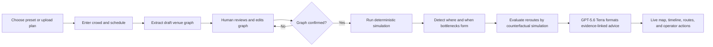

# CrowdFlow Architecture

CrowdFlow is a schedule-aware crowd simulation and operational decision-support prototype for stadiums, concerts, railway stations, airports, and large Indian gatherings such as the Kumbh Mela and IPL matches.

It is intentionally described as a **decision-support prototype**, not certified crowd-safety software. Real deployment requires calibrated sensor data, field validation, local regulations, and qualified crowd-safety review.

## Product flow

Simulation cannot start from a draft graph. Editing a confirmed graph invalidates its confirmation and requires confirmation again.

## Inputs

### Venue

- Top-down venue image or built-in local preset.
- One known physical distance for scale calibration.
- Entries, exits, emergency exits, junctions, attractions, platforms, amenities, and holding areas.
- Directed or bidirectional walkways with length, width, and throughput capacity.
- Node occupancy capacities and optional service rates.

### Demand and schedule

- Total expected crowd.
- Entry distribution and destination weights.
- Explicit schedule blocks, for example gate opening, match halves, interval, final whistle, and egress.
- Per-block arrival rates, destination changes, service demand, and egress fraction.
- Optional operational changes such as closing a path, opening an exit, or metering a gate.

Every built-in preset contains a local SVG plan, a graph, crowd size, and complete schedule so the application is testable without an API call.

## Runtime stack

| Layer | Technology | Responsibility |
|---|---|---|
| Client | React, Vite, TypeScript | Setup, graph review, confirmation, pixel-style live operations UI |
| Server | Express, TypeScript | Sessions, validation, simulation orchestration, OpenAI calls |
| Live transport | WebSocket | Time-ordered simulation snapshots |
| Simulation | Deterministic TypeScript engine | Conservation of people, queues, capacities, dynamic routing |
| Model | OpenAI SDK with `gpt-5.6-terra` | Image-to-draft-graph extraction and structured explanation |
| Hosting | Hugging Face Docker CPU Space | Single public container on port 7860 |

The server loads `OPENAI_TOKEN` from its environment and passes it explicitly to the SDK. It is never sent to the browser, logged, committed, or embedded in an image.

## Graph confirmation gate

A graph is confirmable only when:

- at least one entry and one exit exist;
- every entry has a route to an exit;
- edge endpoints exist;
- lengths, widths, capacities, coordinates, and scale are valid;
- the scenario contains a positive crowd and non-overlapping schedule blocks.

The server stores a hash/version of the confirmed graph. A simulation start request is rejected when the current version differs.

## Schedule-aware simulation

The engine advances in fixed simulated time steps. At each step it:

1. Selects the active schedule block.
2. Injects demand at entries without exceeding total expected attendance.
3. Changes destination weights for the current activity, interval, or egress phase.
4. Moves conserved crowd mass through capacity-limited links.
5. Applies travel time, speed-density degradation, node capacity, and service queues.
6. Records occupancy, density, speed, queues, inflow, outflow, and stranded demand.
7. Detects persistent bottlenecks rather than reacting to a single noisy tick.
8. Updates time-dependent route costs.

Tests assert mass conservation, capacity bounds, deterministic replay, schedule transitions, connectivity, and expected congestion in known fixtures.

## Bottleneck detection

A finding contains evidence, not just a label:

- graph location;
- first warning, predicted critical, peak, and clear times;
- density/capacity ratio;
- speed loss;
- queue growth and inflow/outflow imbalance;
- affected crowd estimate;
- persistence duration and severity;
- schedule phase that contributed to it.

Signals are combined over a persistence window. Thresholds are configuration values and must be calibrated before real operational use.

## Routing

Shortest-path search is only a candidate generator. Route cost includes:

- predicted travel time;
- density and queue penalties;
- residual edge capacity;
- schedule phase;
- hazard exclusions;
- additional walking distance.

The engine generates alternatives, applies each as a bounded policy, re-runs the affected forecast, and reports the change in peak risk, affected crowd, clearance time, and walking time. A route is recommended only when the counterfactual improves configured safety metrics.

## Structured model advice

The deterministic engine creates a `FindingBundle` containing:

- graph and scenario version;
- schedule phase;
- evidence-linked bottlenecks;
- tested route alternatives;
- counterfactual metric deltas;
- allowed operator action types.

The server sends this bundle to `gpt-5.6-terra` through the Responses API with a strict output schema. Advice must cite existing finding, node, edge, and route IDs. The server rejects unknown IDs and unsupported actions. The model explains and ranks computed findings; it does not invent geometry, capacity, physics, or untested routes.

When the model or token is unavailable, the same deterministic findings remain usable and a local evidence-based summary is returned.

## User experience

### Setup

- Choose a domain preset or upload a top-down image.
- See the preset image, crowd amount, entry distribution, and editable schedule.
- Run extraction.

### Review

- Original plan below an editable graph overlay.
- Clear node types, edges, scale, capacities, and validation checklist.
- Explicit confirmation action with no automatic simulation start.

### Live operations

- DelugeRPG-inspired top-down 2D presentation with crisp local SVG assets.
- Aggregate crowd sprites; one sprite represents a group, never an individual person.
- Layer toggles for density, routes, nodes, and bottlenecks.
- Current time, schedule phase, timeline controls, and before/after comparison.
- Accessible labels and patterns in addition to colour.

## API outline

| Method | Path | Purpose |
|---|---|---|
| `GET` | `/api/health` | Runtime health without secret details |
| `GET` | `/api/presets` | Local preset metadata and scenarios |
| `POST` | `/api/sessions` | Create a draft session from a preset |
| `POST` | `/api/sessions/:id/extract` | Extract a draft graph from an uploaded plan |
| `PUT` | `/api/sessions/:id/graph` | Save edits and invalidate confirmation |
| `POST` | `/api/sessions/:id/confirm` | Validate and lock the current graph version |
| `POST` | `/api/sessions/:id/sim/start` | Start only from a confirmed version |
| `WS` | `/api/sessions/:id/stream` | Stream simulation snapshots |
| `POST` | `/api/sessions/:id/advice` | Produce evidence-linked structured advice |

## Deployment

The production image builds the Vite client and Express server, then runs one Node process on port 7860. The same origin serves static files, REST APIs, and WebSockets. Sessions are in memory for the hackathon; Space restarts reset them.

`OPENAI_TOKEN` is configured as a Hugging Face Space secret. Local `.env` files are ignored by Git and Docker.

## Production boundary

The implementation uses established building blocks—capacity-constrained network flow, speed-density relationships, queue dynamics, time-dependent routing, and counterfactual evaluation—but its default parameters are synthetic. Production readiness additionally requires:

- calibrated arrival, speed, density, service, and compliance data;
- comparison with observed trajectories and evacuation drills;
- uncertainty and sensitivity analysis;
- redundant real-time inputs and degraded-mode procedures;
- security, privacy, audit, availability, and load engineering;
- sign-off by venue operators and qualified safety professionals.

No LLM output should directly control signs, gates, barriers, or emergency operations without an authorized human decision.
