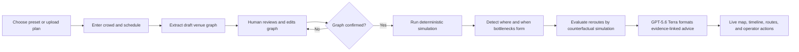

# CrowdFlow Architecture

CrowdFlow is a schedule-aware crowd simulation and operational decision-support prototype for stadiums, concerts, railway stations, airports, IPL matches, and other high-footfall public gatherings.

It is intentionally described as a **decision-support prototype**, not certified crowd-safety software. Real deployment requires calibrated sensor data, field validation, local regulations, and qualified crowd-safety review.

## Product flow

Simulation cannot start from a draft graph. Editing a confirmed graph invalidates its confirmation and requires confirmation again.

## Inputs

### Venue

- Top-down venue image or built-in local preset.
- Visible measurements can inform draft edge lengths; when the plan has no usable measurement, extracted lengths remain explicit, editable estimates.
- Entries, exits, emergency exits, junctions, attractions, platforms, amenities, and holding areas.
- Directed or bidirectional walkways with length, width, and throughput capacity.
- Node occupancy capacities and required aggregate throughput limits.

### Demand and schedule

- Total expected crowd.
- Entry distribution and destination weights.
- Explicit schedule blocks, for example gate opening, match halves, interval, final whistle, and egress.
- Per-block arrival rates, destination changes, and reroute compliance.
- Runtime avoid/prefer route policies that are evaluated before an operator can apply them.

`crowdSize` is an exact total-demand cap, including initial occupancy. On draft creation or confirmation, positive arrival rates retain their relative shape but are scaled so their time integral equals `crowdSize - initialOccupancy`. If the schedule has no positive arrival curve, the server assigns a deterministic flat rate to the first usable non-egress block.

Every built-in preset contains a local raster plan, a graph, crowd size, and complete schedule so the application is testable without an API call. Additional real PNG layouts are stored as upload fixtures.

## Runtime stack

| Layer | Technology | Responsibility |
|---|---|---|
| Client | React, Vite, TypeScript | Setup, graph review, confirmation, pixel-style live operations UI |
| Server | Express, TypeScript | Sessions, validation, simulation orchestration, OpenAI calls |
| Live transport | WebSocket | Time-ordered simulation snapshots |
| Simulation | Deterministic TypeScript engine | Conservation of people, queues, capacities, dynamic routing |
| Model | OpenAI SDK with `gpt-5.6-terra` | Image-to-draft-graph extraction and structured explanation |
| Hosting | Hugging Face Docker CPU Space | Single public container on port 7860 |

The server loads `OPENAI_TOKEN` from its environment and passes it explicitly to the SDK. It is never sent to the browser, logged, committed, or embedded in an image.

## Graph confirmation gate

A graph is confirmable only when:

- at least one entry and one exit exist;
- every entry has a route to its active targets, and phase targets can reach later targets and an exit;
- edge endpoints exist;
- lengths, widths, capacities, free speeds, and normalized coordinates are valid;
- the scenario contains a positive crowd and contiguous schedule blocks that cover the declared duration and end in egress.

The server stores a hash/version of the confirmed graph. A simulation start request is rejected when the current version differs.

## Schedule-aware simulation

The engine advances in fixed simulated time steps. At each step it:

1. Discharges exit nodes and advances in-transit cohorts; each cohort's progress is multiplied by the edge's current occupancy-dependent speed factor.
2. Selects the active schedule block and injects demand at outside entry queues without exceeding the total-demand cap.
3. Admits people subject to gate storage and throughput, then changes their destination weights for the current activity, interval, transfer, or egress phase.
4. Moves conserved crowd mass onto directed links subject to node/edge storage and per-step flow limits.
5. Records physical occupancy/storage ratios, edge speed factors, outside queues, inflow, and outflow.
6. Detects persistent bottlenecks rather than reacting to a single tick.
7. Recomputes congestion-weighted route costs from the current edge state.

Tests assert mass conservation, capacity bounds, deterministic replay, schedule transitions, connectivity, and expected congestion in known fixtures.

## Bottleneck detection

A finding contains evidence, not just a label:

- graph location;
- first observed and detected times for active findings;
- forecast onset, duration, peak ratio, and horizon-decayed confidence;
- physical occupancy/storage ratio and inflow/outflow imbalance;
- outside-queue count, normalized queue pressure, and detector pressure (the maximum of physical occupancy and queue pressure) as separate concepts rather than conflated indoor occupancy;
- queue-growth, gate-imbalance, or stagnation reason, persistence duration, and severity;
- schedule phase that contributed to it.

Signals are combined over a persistence window. Thresholds are configuration values and must be calibrated before real operational use.

## Routing

Shortest-path search is only a candidate generator. Route cost includes:

- free-flow travel time from edge length and walking speed;
- a squared occupancy penalty based on the current edge state;
- phase-specific destinations and compliance;
- avoid/prefer policy penalties for temporarily restricted routes.

The engine exposes deterministic small-K alternatives for the same origin and destination. Separately, it converts congested edges into candidate avoid policies, applies each policy to a cloned state, advances baseline and rerouted states over the same horizon, and reports deltas in peak occupancy ratio, congestion exposure, and completed exits. A policy is applicable only when this counterfactual passes the configured improvement rule.

## Structured model advice

The deterministic engine creates a `FindingBundle` containing:

- the scenario ID and the allowed node/edge ID sets;
- the active schedule phase and arrival rate;
- evidence-linked persistent bottlenecks;
- forecast onset and predicted peak evidence;
- a same-origin/destination alternative only when its primary traverses the finding and the alternative avoids it;
- counterfactual peak, exposure, and exit-throughput deltas.

The server sends this bundle to `gpt-5.6-terra` through the Responses API with a strict output schema. Advice must cite existing finding, evidence, node, and edge IDs. The server rejects unknown IDs and unsupported actions. The model explains and ranks computed findings; it does not invent geometry, capacity, physics, or untested routes.

When the model or token is unavailable, the same deterministic findings remain usable and a local evidence-based summary is returned.

## User experience

### Setup

- Choose a domain preset or upload a top-down image.
- See the preset image, crowd amount, entry distribution, and editable schedule.
- Run extraction.

### Review

- Original plan below an editable graph overlay.
- Editable node types/positions/capacities and directed-link endpoints, lengths, widths, capacities, flow limits, and free speeds, plus a validation checklist.
- Explicit confirmation action with no automatic simulation start.

### Live operations

- DelugeRPG-inspired top-down 2D presentation with real local raster plans and crisp graph overlays.
- Aggregate crowd sprites; one sprite represents a group, never an individual person.
- Layer toggles for density, routes, nodes, and bottlenecks.
- Current time, schedule phase, timeline controls, and before/after comparison.
- Accessible labels and patterns in addition to colour.

## API outline

| Method | Path | Purpose |
|---|---|---|
| `GET` | `/api/health` | Runtime health without secret details |
| `GET` | `/api/presets` | Local preset metadata and scenarios |
| `POST` | `/api/sessions` | Create a preset draft or multipart image-extraction session |
| `PUT` | `/api/sessions/:id/graph` | Save edits and invalidate confirmation |
| `POST` | `/api/sessions/:id/confirm` | Validate and lock the current graph version |
| `POST` | `/api/sessions/:id/sim/start` | Start only from a confirmed version |
| `POST` | `/api/sessions/:id/sim/control` | Pause, resume, or change simulation speed |
| `GET` | `/api/sessions/:id/snapshot` | Retrieve the latest deterministic snapshot |
| `WS` | `/api/sessions/:id/stream` | Stream simulation snapshots |
| `POST` | `/api/sessions/:id/advice` | Produce evidence-linked structured advice |
| `POST` | `/api/sessions/:id/reroute` | Apply a human-approved, counterfactually evaluated policy |

## Deployment

The production image builds the Vite client and Express server, then runs one Node process on port 7860. The same origin serves static files, REST APIs, and WebSockets. Sessions are in memory for the hackathon; Space restarts reset them.

`OPENAI_TOKEN` must be configured as a Hugging Face Space secret when the Space is created. Local `.env` files are ignored by Git and Docker.

## Production boundary

The implementation uses established building blocks--capacity-constrained network flow, occupancy-speed relationships, queue dynamics, time-dependent routing, and counterfactual evaluation--but its default parameters are synthetic. Production readiness additionally requires:

- calibrated arrival, speed, density, service, and compliance data;
- comparison with observed trajectories and evacuation drills;
- uncertainty and sensitivity analysis;
- redundant real-time inputs and degraded-mode procedures;
- security, privacy, audit, availability, and load engineering;
- sign-off by venue operators and qualified safety professionals.

No LLM output should directly control signs, gates, barriers, or emergency operations without an authorized human decision.
