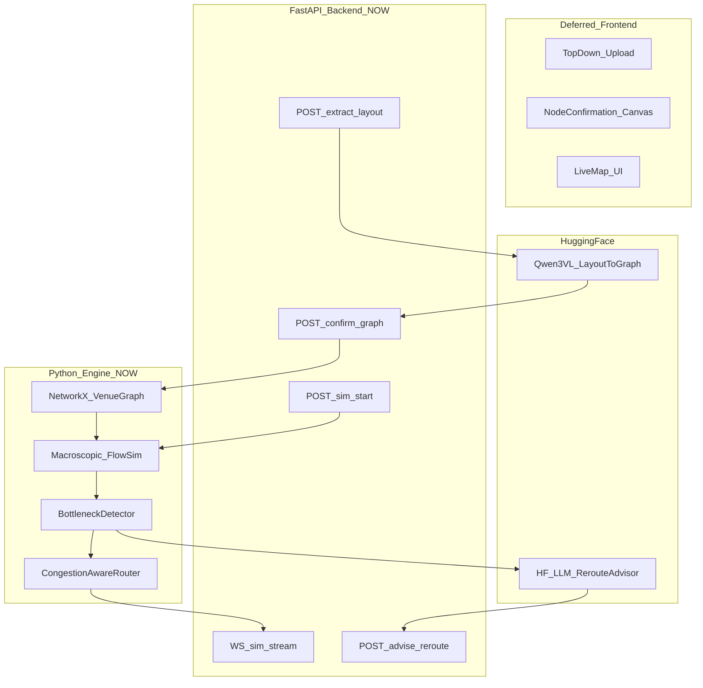

# Crowd Flow Optimiser — End-to-End Architecture

**Hackathon:** AI Race Month · Problem Statement 3  
**Sponsor constraint:** Hugging Face mandatory in the intelligent core  
**Core approach (locked):** Approach 1 — Hybrid Graph-Macro + HF VLM + HF Advisor  
**Build window:** ~3 days  
**Status:** Architecture locked  
**Current build focus (locked):** **Backend only** — image → nodes/graph → simulation → bottlenecks/reroutes. Frontend deferred.

---

## 0. Current focus (read this first)

Until backend is solid, **do not build the Next.js UI**.

| In scope now | Deferred |
|---|---|
| FastAPI app + Pydantic schemas | Next.js setup / confirm / live pages |
| HF VLM layout extraction (image → graph JSON) | Visual node-confirm canvas (logic exists as API validate/confirm) |
| NetworkX graph build + validation | Live map rendering |
| Macroscopic simulator | WebSocket client UI |
| Bottleneck detection + congestion routing | Polish / branding |
| HF LLM advisor (API) | Full Docker Compose web service |
| pytest / curl / scripts for end-to-end backend demos | Vercel deploy |

**Backend acceptance path:**

```text
top-down image + crowd size + schedule
        → HF VLM extract
        → graph validate/confirm (API)
        → sim run (REST ticks or WS)
        → bottlenecks + routes + advisor JSON
```

Frontend later consumes the same APIs unchanged.

---

## 1. Product in one paragraph

Upload a **top-down venue layout**, enter **expected crowd size** and an **event schedule**, **confirm** extracted nodes (UI later; API now), then run a simulation that produces **bottleneck zones** and **recommended rerouting paths**. Hugging Face models extract the layout graph and advise reroutes; a Python macroscopic simulator owns crowd physics.

---

## 2. Locked decisions

| Decision | Choice |
|---|---|
| Intelligent core | Approach 1 |
| Layout input | Top-down image (primary) |
| Crowd + schedule | Manual entry (required for sim) |
| Graph trust | Confirm step before sim (API now; visual UI later) |
| **Build order** | **Backend first** |
| Frontend (later) | Next.js (TypeScript) |
| Backend / sim / HF | Python FastAPI |
| Real-time stream | WebSockets (backend now; client later) |
| Graph model | NetworkX |
| Pathfinding | Congestion-weighted Dijkstra / A* (squared density penalty) |
| HF models | Qwen3-VL-8B extract + Qwen3-4B advisor (`featherless-ai`) |
| Deploy (backend) | Local Uvicorn + optional HF Space later |

---

## 3. System architecture



### Responsibility split

| Layer | Owns | Does not own |
|---|---|---|
| FastAPI (now) | Orchestration, schemas, WS, HF client, sim | Pixel UI |
| HF VLM | Nodes/edges/POI from top-down image | Simulation timesteps |
| Python sim | Density, queues, bottlenecks, base paths | Natural-language advice |
| HF LLM | Ranked reroute actions + operator copy | Inventing geometry |
| Next.js (later) | Upload, confirm canvas, live map | Crowd physics |

---

## 4. Tech stack

### Backend now (`apps/api`)

- Python 3.11+
- FastAPI + Uvicorn
- Pydantic v2
- NetworkX
- NumPy
- httpx / `huggingface_hub` (Inference Providers / OpenAI-compatible client)
- python-multipart
- pytest + httpx AsyncClient for tests

### Frontend later (`apps/web`)

- Next.js 15 + TypeScript + Tailwind
- Canvas/React Flow for node confirm
- Zustand + WebSocket client

### Hugging Face

| Role | Model | Usage |
|---|---|---|
| Layout extraction | `Qwen/Qwen3-VL-8B-Instruct` via `featherless-ai` | Image → venue JSON |
| Reroute advisor | `Qwen/Qwen3-4B-Instruct-2507` via `featherless-ai` | Bottleneck telemetry → actions |
| Stretch | CSRNet / PET | Density on rendered frames |

---

## 5. Hugging Face cost estimate

Prices move; treat this as a **planning band**, not an invoice. Sources: [HF Inference Providers pricing](https://huggingface.co/docs/inference-providers/en/pricing), [Inference Endpoints pricing](https://huggingface.co/docs/inference-endpoints/en/pricing), provider pass-through rates for Qwen3-VL / Qwen3 chat models.

### 5.1 Account / credits

| Plan | Monthly HF credits (Inference Providers) | Notes |
|---|---|---|
| Free | ~$0.10 | Too small for real VLM work |
| PRO | ~$2.00 + $9/mo subscription | Good for light hackathon use |
| Pay-as-you-go after credits | Provider rates, no HF markup | Recommended for demo week |

### 5.2 Recommended hackathon mode: Inference Providers (serverless)

**Not** always-on dedicated GPUs (those get expensive fast).

| Call type | Assumed tokens / call | Assumed rate | Cost / call |
|---|---|---|---|
| VLM layout extract (image + schema prompt → JSON) | ~4k–12k input-equivalent + ~1k–2k output | ~$0.20 / 1M tok | **~$0.001 – $0.003** |
| LLM reroute advisor | ~1.5k in + ~400 out | ~$0.10–$0.20 / 1M | **~$0.0002 – $0.0005** |

Image tokenization for VLMs varies by resolution; budget the **high end** of the band.

### 5.3 Scenario budgets

| Scenario | Volume | Est. HF spend |
|---|---|---|
| Backend unit/integration testing (mock VLM on, HF off) | 0 HF calls | **$0** |
| Dev week: 100 extracts + 300 advisor calls | ~100 VLM + 300 LLM | **~$0.20 – $0.50** |
| Demo day: 30 live extracts + 100 advisor calls | light | **~$0.10 – $0.25** |
| Heavy iteration: 500 extracts + 1k advisor | active coding | **~$1 – $3** |
| Contingency / retries / larger images | +50% | add **~$1–2** |

**Practical team budget (locked preference):**  
**$5 Inference Providers credits, no PRO** — enough if we stay mock-heavy for sim loops and use live HF only for extract + sparse advisor calls. Free-tier rate limits apply; cache aggressively.

### 5.4 What NOT to do (cost traps)

| Trap | Why it hurts | Prefer |
|---|---|---|
| Always-on T4 Inference Endpoint | ~$0.50/hr → **~$12/day**, **~$360/mo** if left up | Serverless Providers + scale-to-zero if you must use Endpoints |
| Always-on A10G / A100 for VLM | $1–$2.5+/hr | Only for timed demo windows |
| Calling VLM every sim tick | Burns money, adds latency | Extract **once** per image; cache by image hash |
| No mock path | Blocks coding when quota dies | `EXTRACT_MODE=mock|hf` env flag |

### 5.5 Cost controls (build these into backend)

1. `HF_EXTRACT_CACHE` — disk/memory cache keyed by image hash  
2. `EXTRACT_MODE=mock|hf` — default mock in tests  
3. Advisor only on demand (`POST /advise`), not every tick  
4. Cap image size before VLM (e.g. longest edge 1280)  
5. Hard spending limit in HF billing settings  

---

## 6. Hugging Face MCP (build & test alongside)

### 6.1 Current status in this Cursor session

| Item | Status |
|---|---|
| HF MCP server | **Connected** as [`@Mradulterated`](https://huggingface.co/Mradulterated) (`user-hf-mcp-server`) |
| Account | User, **not PRO** (as of last check) |
| OAuth scopes granted | `inference-api`, `jobs`, `read-repos`, `contribute-repos`, `read-mcp`, … |
| Official HF skills | **Installed** under `.agents/skills/` (see §7) |

### 6.1b Can credits alone let the agent manage compute / experiments?

**Short answer: mostly yes for serverless experimentation — with guardrails. Not a blank check for always-on GPUs.**

| You do once | Agent can then do |
|---|---|
| Add Inference Providers **credits** (and ideally PRO) | Call models via Inference / MCP Spaces for extract & advisor experiments |
| Keep MCP connected (OAuth) | Search Hub, inspect model cards, run Space tasks, iterate prompts |
| Put `HF_TOKEN` in `apps/api/.env` (for FastAPI) | Backend pytest/demo scripts hit real HF during Phase B3 |
| Set a **spending limit** in HF billing | Agent stays inside that ceiling |

| Agent will manage | Agent will NOT do without explicit ask |
|---|---|
| Prompt/model experiments for VLM extract + advisor | Spin up always-on Inference Endpoints (T4/A10/etc.) |
| Cache + `EXTRACT_MODE=mock\|hf` to control spend | Leave paid GPUs running overnight |
| Prefer serverless Inference Providers | Train large models / burn ZeroGPU minutes casually |
| Document which model IDs worked | Change billing plan / buy credits for you |

**Locked money setup**

1. **$5 Inference Providers credits** (no PRO for now).  
2. Set a **spending limit** at ~$5 so nothing overruns.  
3. Default `EXTRACT_MODE=mock` / advisor mock in tests; flip to HF only for real extract/advisor experiments and demos.  
4. No dedicated Endpoints unless explicitly approved.

### 6.1c Where credits are consumed vs free local compute

Credits are charged **only when a Hugging Face Inference / Provider / (billable) Space call runs**. Graph math and the simulator do **not** use HF credits.

```text
[1] Upload top-down image
        │
        ▼
[2] HF VLM extract  ←←←  $$$ CREDITS  (Qwen3-VL)
        │
        ▼
[3] Graph post-process + confirm  ←  FREE local (NetworkX / Pydantic)
        │
        ▼
[4] Scenario (crowd + schedule)   ←  FREE local
        │
        ▼
[5] Macroscopic simulation loop   ←  FREE local (NumPy / custom flow)
        │
        ├─ bottleneck rules       ←  FREE local
        └─ congestion routing     ←  FREE local (Dijkstra/A*)
        │
        ▼
[6] HF LLM advisor (on demand)  ←←←  $$$ CREDITS  (Qwen3-4B)
        │
        ▼
[7] Apply actions + re-route      ←  FREE local
```

| Stage | Model / algo | Credits? | Typical cost from $5 |
|---|---|---|---|
| Layout extract | **HF:** `Qwen/Qwen3-VL-8B-Instruct` | **Yes** (each uncached call) | ~$0.001–$0.003 / call → **~$0.10–$0.50** for ~50–100 cached-aware extracts |
| Graph build / validate / confirm | **Local:** NetworkX + schema checks | No | $0 |
| Crowd + schedule driver | **Local:** discrete-time schedule logic | No | $0 |
| Crowd simulation | **Local:** macroscopic flow / queues | No | $0 |
| Bottleneck detection | **Local:** density/capacity, stagnation, flux rules | No | $0 |
| Path / reroute geometry | **Local:** congestion-weighted Dijkstra/A* (`length × (1+α·density²)`) | No | $0 |
| Reroute advisor text/actions | **HF:** `Qwen/Qwen3-4B-Instruct-2507` | **Yes** (each `/advise` call) | ~$0.0002–$0.0005 / call → **~$0.05–$0.20** for hundreds of calls |
| Stretch: density on rendered frames | **HF:** CSRNet / PET (optional Day-3) | **Yes if enabled** | Avoid on $5 unless leftover |
| MCP Hub search / model cards | HF MCP Hub tools | Usually **no** inference bill | $0 |
| Mock extract / mock advisor | Fixtures in repo | No | $0 |

**$5 budget rule of thumb**

| Use of the $5 | Approx. room |
|---|---|
| Safe operating mode | ~30–80 real VLM extracts (with cache) + plenty of advisor calls |
| Burn risk | Re-extracting the same image every test without cache; enabling stretch CV models |
| What should eat almost none of it | All sim ticks, bottleneck math, routing |

**Bottom line with $5 no-PRO:** Fully workable for this architecture if HF is only used at **extract** and **advisor**, everything else stays local, and we cache extracts by image hash.

### 6.2 What HF MCP is (and is not)

**Is:** hosted MCP at `https://huggingface.co/mcp` — search Hub models/datasets/Spaces/papers, use selected community Space tools from inside Cursor.

**Is not:** a replacement for our FastAPI Inference client. Layout extraction and advisor calls still go through **HF Inference Providers / API with `HF_TOKEN`** from the backend.

For build-and-test alongside the agent you want **both**:

1. **HF MCP** — discover models, inspect cards, optionally Space tools  
2. **`HF_TOKEN` in backend `.env`** — real extract/advise calls from FastAPI  

### 6.3 How you connect (do this once)

1. Open [https://huggingface.co/settings/mcp](https://huggingface.co/settings/mcp) while logged in  
2. Choose **Cursor** → copy the config snippet  
3. Add to project file `.cursor/mcp.json` (recommended):

```json
{
  "mcpServers": {
    "hugging-face": {
      "url": "https://huggingface.co/mcp"
    }
  }
}
```

4. Cursor → **Settings → Tools & MCP** → connect **Hugging Face** (OAuth)  
5. Restart / reload MCP  
6. Confirm tools like Hub search appear for the agent  

Also create a write token: [https://huggingface.co/settings/tokens](https://huggingface.co/settings/tokens) → put in `apps/api/.env` as `HF_TOKEN=hf_...` (never commit).

### 6.4 Optional: Gradio Spaces as MCP tools

From HF MCP settings you can enable specific Spaces as tools (e.g. a small VLM playground). Useful for interactive checks; production path remains FastAPI → Inference Providers.

---

## 7. Skills & plugins installed

Installed into the repo via `npx skills` (project: `.agents/skills/`):

| Skill | Source | Why |
|---|---|---|
| `hf-cli` | `huggingface/skills` | Hub CLI / auth / model ops |
| `huggingface-best` | `huggingface/skills` | HF best practices |
| `huggingface-local-models` | `huggingface/skills` | Local/transformers usage patterns |
| `huggingface-spaces` | `huggingface/skills` | Spaces deploy patterns (demo later) |
| `fastapi` | official `fastapi/fastapi` | FastAPI idioms |
| `fastapi-templates` | `wshobson/agents` | FastAPI project structure |

**Note:** `huggingface-spaces` was flagged higher risk by skills.sh audit — review before using Space-deploy automation.

**Still needed from you:** HF MCP OAuth connect (§6.3). Optional later: project Cursor rule that says “backend-first; use HF mock unless `EXTRACT_MODE=hf`”.

---

## 8. User / API flow (backend-shaped)

1. `POST /sessions`  
2. `POST /sessions/{id}/layout/extract` — image → HF VLM (or mock) → draft graph  
3. `PUT /sessions/{id}/graph` — manual corrections (stand-in for confirm UI)  
4. `POST /sessions/{id}/graph/confirm` — validate connectivity / required node types  
5. `PUT /sessions/{id}/scenario` — crowd size + schedule blocks  
6. `POST /sessions/{id}/sim/start` + `WS /sim/stream` (or `GET` tick polling for tests)  
7. `POST /sessions/{id}/advise` — HF LLM actions JSON  
8. `POST /sessions/{id}/actions/apply` — mutate meters/weights, recompute routes  

---

## 9. Data contracts

### 9.1 Event schedule

```json
{
  "timezone": "Asia/Kolkata",
  "blocks": [
    {
      "id": "main_event",
      "label": "Main event",
      "type": "attraction",
      "start": "18:00",
      "end": "20:00",
      "attractors": ["stage", "seating"],
      "arrival_rate_per_min": 40
    },
    {
      "id": "break",
      "label": "Intermission",
      "type": "break",
      "start": "20:00",
      "end": "20:30",
      "attractors": ["food_court", "restrooms"],
      "arrival_rate_per_min": 10
    },
    {
      "id": "egress",
      "label": "Exit rush",
      "type": "egress",
      "start": "20:30",
      "end": "21:00",
      "attractors": ["exit_a", "exit_b"],
      "arrival_rate_per_min": 0
    }
  ]
}
```

### 9.2 Venue graph

```json
{
  "image_size": { "width": 1600, "height": 900 },
  "nodes": [
    {
      "id": "gate_n",
      "type": "entry_gate",
      "label": "North Gate",
      "x": 0.12,
      "y": 0.08,
      "capacity": 80,
      "confirmed": true
    },
    {
      "id": "food_1",
      "type": "concession",
      "label": "Food Stall A",
      "x": 0.55,
      "y": 0.42,
      "capacity": 40,
      "service_rate_per_min": 12,
      "confirmed": true
    },
    {
      "id": "exit_e",
      "type": "emergency_exit",
      "label": "East Exit",
      "x": 0.92,
      "y": 0.50,
      "capacity": 100,
      "confirmed": true
    }
  ],
  "edges": [
    {
      "id": "e1",
      "source": "gate_n",
      "target": "food_1",
      "type": "walkway",
      "length_m": 45,
      "width_m": 3.5,
      "capacity": 120
    }
  ]
}
```

**Node types (minimum):** `entry_gate`, `walkway_junction`, `concession`, `seating` / `attraction`, `restroom`, `emergency_exit`, `exit`  
Coordinates normalized **0–1** relative to the image.

### 9.3 Simulation tick

```json
{
  "t": 312.0,
  "sim_time": "20:12",
  "nodes": {
    "gate_n": { "density": 0.82, "count": 66, "risk": 0.71 },
    "food_1": { "density": 0.94, "count": 38, "risk": 0.88 }
  },
  "edges": {
    "e1": { "flow": 22, "speed_factor": 0.41, "congested": true }
  },
  "bottlenecks": [
    {
      "id": "bn_food_1",
      "node_id": "food_1",
      "severity": "critical",
      "eta_critical_s": 0,
      "reason": "queue_exceeds_capacity"
    }
  ],
  "routes": [
    {
      "id": "r1",
      "purpose": "avoid_food_1",
      "path_node_ids": ["gate_n", "junction_2", "food_2"],
      "cost": 12.4
    }
  ]
}
```

### 9.4 HF LLM advisor output

```json
{
  "actions": [
    {
      "type": "reroute",
      "from_node": "gate_n",
      "avoid": ["food_1"],
      "prefer": ["food_2"],
      "priority": 1
    },
    {
      "type": "throttle_gate",
      "node_id": "gate_n",
      "meter_per_min": 30,
      "priority": 2
    }
  ],
  "summary": "Food Stall A is past critical density. Divert North Gate arrivals to Stall B and meter entry."
}
```

---

## 10. Intelligent core

### 10.1 Layout extraction (HF VLM)

Input: top-down image + strict JSON schema prompt.  
Output: candidate nodes + edges.  
Post-process: clamp coords, dedupe, connectivity sanity, `confirmed: false` until confirm API.  
Fallback: `EXTRACT_MODE=mock` sample graph.

### 10.2 Confirm gate (API)

Sim cannot start until: ≥1 entry, ≥1 exit, path entry→exit, confirm called.

### 10.3 Macroscopic simulation

Schedule-driven arrivals → capacity-limited edge flow → concession queues → density/risk fields → tick emit.  
Not Social Force for MVP.

### 10.4 Bottlenecks

Density/capacity, stagnation, queue growth, gate imbalance, schedule-phase spikes.  
Severities: `watch` → `warning` → `critical`.

### 10.5 Rerouting

Algorithmic: `cost = length * (1 + α * density^2)`.  
HF advisor: structured actions + summary; apply mutates meters/weights.

---

## 11. API surface

| Method | Path | Purpose |
|---|---|---|
| `POST` | `/api/sessions` | Create session |
| `POST` | `/api/sessions/{id}/layout/extract` | Image → draft graph |
| `GET` | `/api/sessions/{id}/graph` | Get graph |
| `PUT` | `/api/sessions/{id}/graph` | Edit graph |
| `POST` | `/api/sessions/{id}/graph/confirm` | Validate + lock |
| `PUT` | `/api/sessions/{id}/scenario` | Crowd + schedule |
| `POST` | `/api/sessions/{id}/sim/start` | Start / reset |
| `POST` | `/api/sessions/{id}/sim/pause` | Pause |
| `GET` | `/api/sessions/{id}/sim/tick` | Single tick (easy testing) |
| `WS` | `/api/sessions/{id}/sim/stream` | Live ticks |
| `POST` | `/api/sessions/{id}/advise` | HF advisor |
| `POST` | `/api/sessions/{id}/actions/apply` | Apply action |
| `GET` | `/api/health` | Health + HF reachability |

---

## 12. Repo structure (backend-first)

```text
GrandPrix/
├── apps/
│   └── api/                 # ONLY focus for now
│       ├── app/main.py
│       ├── app/routers/
│       ├── app/schemas/
│       ├── app/services/
│       │   ├── hf_vlm.py
│       │   ├── hf_advisor.py
│       │   ├── graph_builder.py
│       │   ├── simulator.py
│       │   ├── bottlenecks.py
│       │   └── routing.py
│       ├── tests/
│       ├── scripts/demo_backend.py
│       └── requirements.txt
├── .agents/skills/          # installed HF + FastAPI skills
├── docs/
│   └── ARCHITECTURE.md
└── README.md
```

`apps/web` is intentionally not scaffolded until backend demos cleanly.

---

## 13. Backend build plan (replaces old Day 1–3 UI plan)

### Phase B1 — Skeleton + schemas + mock extract

- FastAPI app, session store, Pydantic contracts  
- Mock VLM returning a stadium/station sample graph  
- Graph validate/confirm  
- Scenario (crowd + schedule)  

### Phase B2 — Simulator + bottlenecks + routes

- Macroscopic engine  
- Bottleneck detector  
- Congestion-aware routing  
- `GET /sim/tick` + WebSocket stream  
- pytest covering a full mock run  

### Phase B3 — Real HF + advisor

- Wire Qwen3-VL with cache + mock fallback  
- HF LLM advisor + apply actions  
- `scripts/demo_backend.py` for judge/backend walkthrough  
- README: HF setup, cost notes, env vars  

Frontend (old Day 1–3 UI work) starts only after B2/B3 are demoable via script/curl.

---

## 14. Risks and mitigations

| Risk | Mitigation |
|---|---|
| VLM mis-extracts nodes | Confirm API + editable graph JSON |
| HF latency / quota | Cache + mock mode + spending limit |
| Cost surprise | Serverless Providers; never leave Endpoints on |
| Sim too slow | Macroscopic mass flow |
| Graph disconnected | Confirm-time validation |
| Scope creep into UI | Backend-first lock in this doc |
| MCP not connected | Manual OAuth steps in §6.3 |

---

## 15. Success criteria (backend phase)

- Image + crowd + schedule all affect sim outputs  
- Extract → confirm → sim path works with mock and HF modes  
- Bottlenecks change across schedule phases  
- Advisor returns structured actions; apply changes routes  
- HF usage is explicit, cached, and cost-bounded  

---

## 16. Out of scope for current phase

- Next.js / visual confirm canvas / live map UI  
- Real CCTV ingestion  
- Training a custom ST-GNN  
- JuPedSim / Vadere  
- Auth, DB, mobile  

---

## 17. Reference codebases

- [DeemonDuck/StadiumMind](https://github.com/DeemonDuck/StadiumMind) — venue graph + congestion-aware routing  
- [ctrlaltyash/CrowdControl](https://github.com/ctrlaltyash/CrowdControl) — density/risk fields  
- [AayuStark007/EvacSim-Public](https://github.com/AayuStark007/EvacSim-Public) — LLM responders pattern (swap to HF)  
- HF: Qwen3-VL (+ FloorplanVLM adapters if CAD-like)

---

## 18. Your action items before backend implementation

1. **Connect HF MCP** using §6.3 (Agent cannot write `mcp.json` while plan mode blocks non-md files).  
2. Create **`HF_TOKEN`** and keep PRO/credits ready (~$10–25 budget).  
3. Say **go / execute / start backend** when you want Phase B1 scaffolded.
